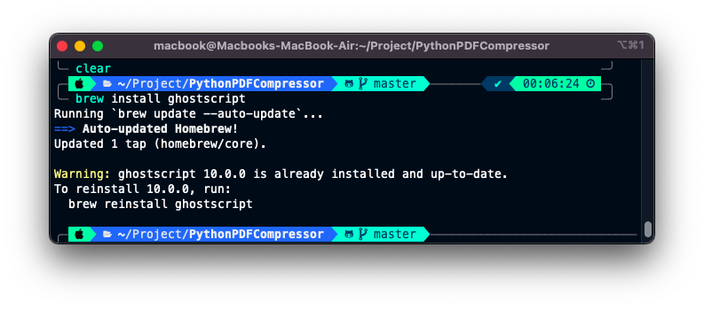

# PythonPDFcompressor
Compress PDF using python

## Installation
1. Need to install ghostscript `brew install ghostscript` 

#Usage
1. Open Terminal
2. Type `python3 pythonPDFCompressor -o outputfile.pdf -inputfile.pdf`
3. Enter
